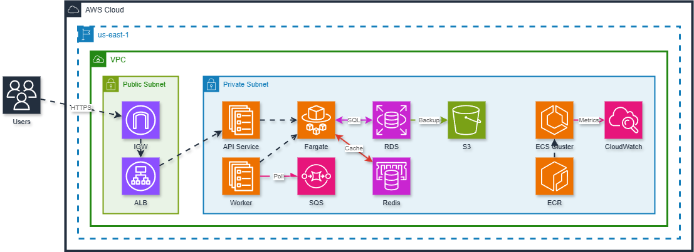
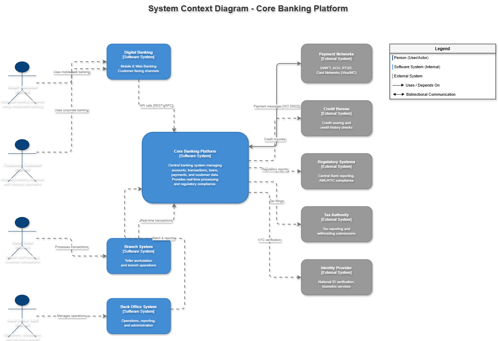

# CLAUDE.md Project-Specific Instructions Samples

A mono-repo containing sample `CLAUDE.md` files for different use cases with Claude Code.

## What is CLAUDE.md?

`CLAUDE.md` is a project-specific instruction file that Claude Code automatically loads when working in a directory. It allows you to:

- Define coding standards and conventions
- Provide domain-specific knowledge
- Set up shape/style references for diagram generation
- Configure project-specific workflows

## Projects

| Project | Description | Status |
|---------|-------------|--------|
| [claude-md-drawio](./claude-md-drawio/) | DrawIO architecture diagram generation | Active |
| [claude-md-excel](./claude-md-excel/) | Excel/spreadsheet generation | Planned |

## File Structure

```
mono-sample-claude-project-specific-instruction/
├── README.md
├── .gitignore
│
├── claude-md-drawio/
│   ├── CLAUDE.md                              # Main instruction file (93KB)
│   ├── README.md
│   │
│   ├── sample-architecture/                   # Cloud & infrastructure diagrams
│   │   ├── README.md
│   │   ├── sample-architecture-aws-ecs.drawio/.png
│   │   ├── sample-architecture-azure-webapp.drawio/.png
│   │   ├── sample-architecture-aws-portal-k8s-insurance.drawio/.png
│   │   └── sample-architecture-insurance-cobroker-portal-k8s-onprem.drawio/.png
│   │
│   ├── sample-c4-model/                       # C4 Model architecture
│   │   ├── README.md
│   │   └── sample-c4-model-core-banking.drawio/.png
│   │
│   ├── sample-domain-driven-design/           # DDD diagrams
│   │   ├── README.md
│   │   └── sample-domain-driven-design-core-banking.drawio/.png
│   │
│   ├── sample-entity-erd/                     # Database ERD
│   │   ├── README.md
│   │   └── sample-entity-property-agent-database.drawio/.png
│   │
│   ├── sample-sequence/                       # Sequence diagrams
│   │   ├── README.md
│   │   └── sample-sequence-payment-flow.drawio/.png
│   │
│   └── sample-autoclickkey-workflow/          # Application workflow
│       ├── README.md
│       └── data-workflow-diagram.drawio
│
└── claude-md-excel/                           # Excel generation (planned)
    └── ...
```

## Sample Diagrams

| Category | Folder | Samples |
|----------|--------|---------|
| Cloud Architecture | [sample-architecture/](./claude-md-drawio/sample-architecture/) | AWS ECS, Azure WebApp, AWS+K8s Hybrid, On-Prem K8s |
| C4 Model | [sample-c4-model/](./claude-md-drawio/sample-c4-model/) | Core Banking (Context, Container, Component) |
| Domain-Driven Design | [sample-domain-driven-design/](./claude-md-drawio/sample-domain-driven-design/) | Core Banking bounded contexts |
| Database ERD | [sample-entity-erd/](./claude-md-drawio/sample-entity-erd/) | Property Agent (PostgreSQL, MongoDB, Redis, ES) |
| Sequence Diagram | [sample-sequence/](./claude-md-drawio/sample-sequence/) | Payment Flow |
| Application Workflow | [sample-autoclickkey-workflow/](./claude-md-drawio/sample-autoclickkey-workflow/) | [AutoClickKey](https://github.com/MrParkerZ7/app-auto-key-click-x-claude) Data Flow |

## Preview





## Usage

1. Copy the relevant `CLAUDE.md` to your project root
2. Claude Code will automatically load it when working in that directory
3. Ask Claude to generate diagrams/files following the guidelines

## How CLAUDE.md Works

```
your-project/
├── CLAUDE.md          # Auto-loaded by Claude Code
├── src/
│   └── CLAUDE.md      # Also loaded when working in src/
└── ...
```

- Claude Code reads `CLAUDE.md` from project root automatically
- Subdirectory `CLAUDE.md` files are loaded when working in those directories
- All instructions are available in Claude's context without manual file reads

## License

MIT
