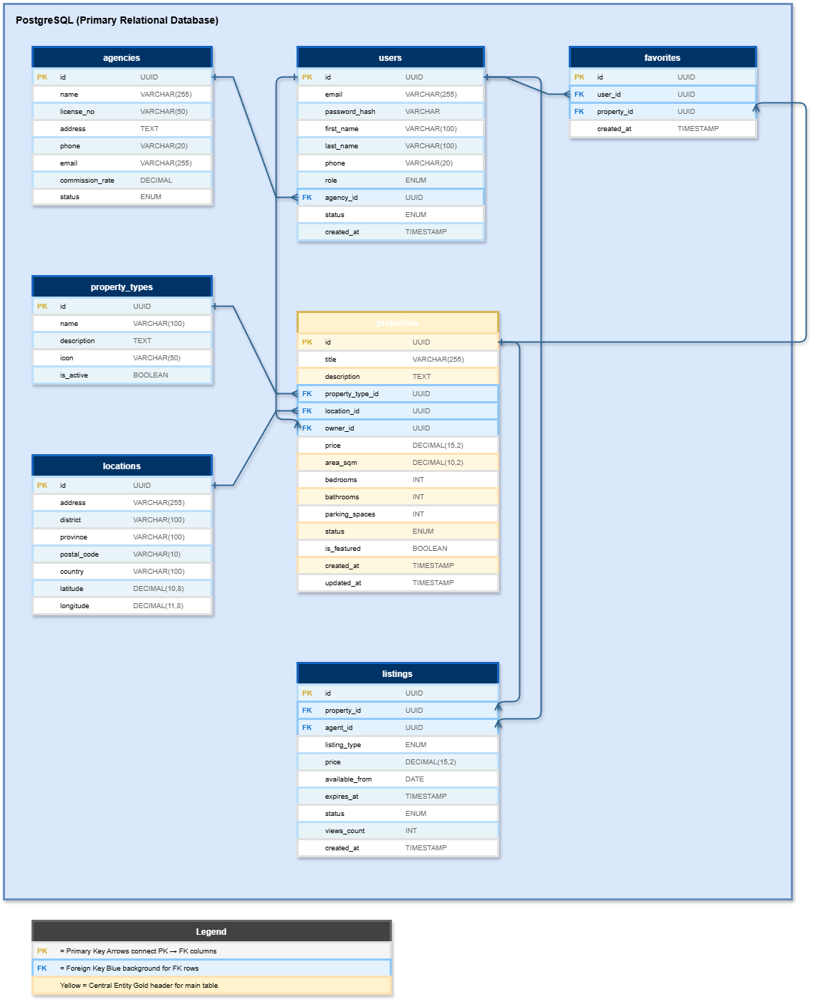

# DrawIO CLAUDE.md Research

Project-specific instructions (CLAUDE.md) for Claude Code to generate DrawIO architecture diagrams.

## Purpose

This folder contains research and reference materials for creating `CLAUDE.md` files that enable Claude Code to generate professional DrawIO diagrams.

## Contents

### CLAUDE.md

The main reference file containing:
- DrawIO XML structure and syntax
- Shape references for all major platforms (AWS, Azure, GCP, Kubernetes)
- Network and infrastructure shapes
- C4 Model architecture diagrams
- Software architecture patterns (DDD, microservices, UML)
- Database ERD (Entity-Relationship Diagrams)
- Data workflow and ETL shapes
- BPMN, flowcharts, sequence diagrams
- Arrow color standards (protocol-based)
- Style guidelines, colors, and best practices

### Sample Diagrams

Reference diagrams organized by category:

| Folder | Description | Samples |
|--------|-------------|---------|
| [sample-architecture/](./sample-architecture/) | Cloud & infrastructure diagrams | AWS ECS, Azure WebApp, AWS+K8s, On-Prem K8s |
| [sample-c4-model/](./sample-c4-model/) | C4 Model architecture | Core Banking (Context, Container, Component) |
| [sample-domain-driven-design/](./sample-domain-driven-design/) | DDD diagrams | Core Banking bounded contexts |
| [sample-entity-erd/](./sample-entity-erd/) | Database ERD | Property Agent (PostgreSQL, MongoDB, Redis, ES) |
| [sample-sequence/](./sample-sequence/) | Sequence diagrams | Payment Flow |
| [sample-autoclickkey-workflow/](./sample-autoclickkey-workflow/) | Application workflow | [AutoClickKey](https://github.com/MrParkerZ7/app-auto-key-click-x-claude) data flow |

### Preview

#### Cloud Architecture

#### C4 Model

#### Entity-Relationship Diagram

## Usage

1. Copy `CLAUDE.md` to your project root or relevant subdirectory
2. Claude Code will automatically load the instructions when working in that directory
3. Ask Claude to create DrawIO diagrams - it will follow the guidelines
4. Reference sample diagrams for expected output format

## Arrow Color Standards

Protocol-based colors for consistent architecture diagrams:

| Protocol | Color | Hex |
|----------|-------|-----|
| HTTP/HTTPS/API | Gray | `#232F3E` |
| Database (SQL) | Purple | `#C925D1` |
| Cache (Redis) | Red | `#DC382D` |
| Message Queue | Pink | `#E7157B` |
| Storage | Green | `#7AA116` |
| Auth/Security | Dark Red | `#DD344C` |

## Diagram Types Supported

- Cloud Architecture (AWS, Azure, GCP)
- Kubernetes cluster architecture
- C4 Model (Context, Container, Component)
- Domain-Driven Design diagrams
- Sequence diagrams
- Network topology
- Data flow and ETL pipelines
- BPMN workflow diagrams
- Database ERD (multi-database: SQL, NoSQL, Cache, Search)
- Application data workflow
